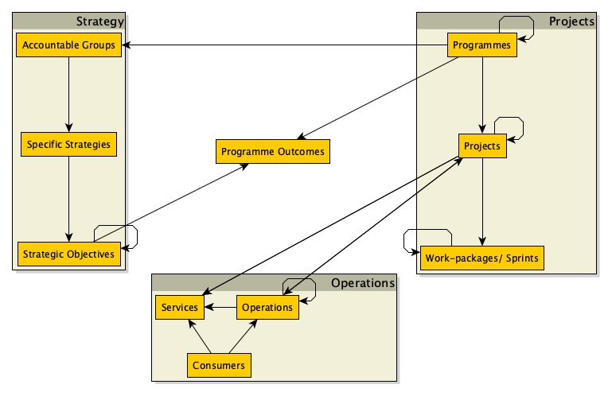
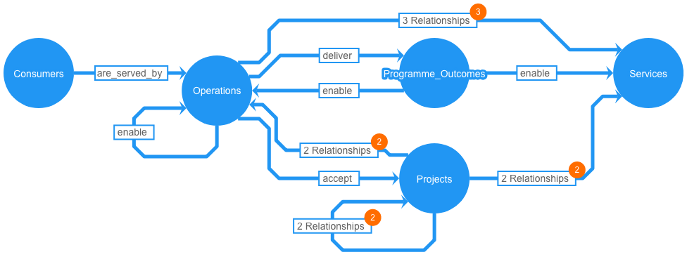
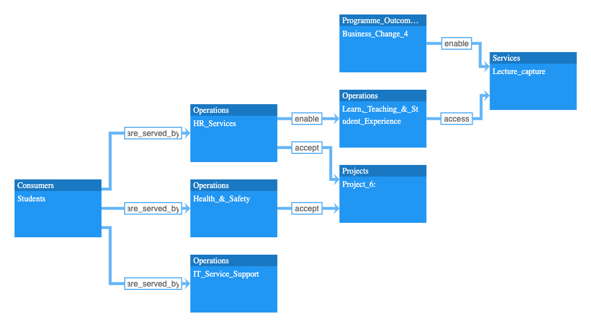
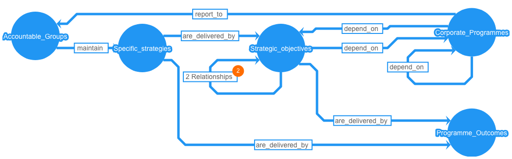
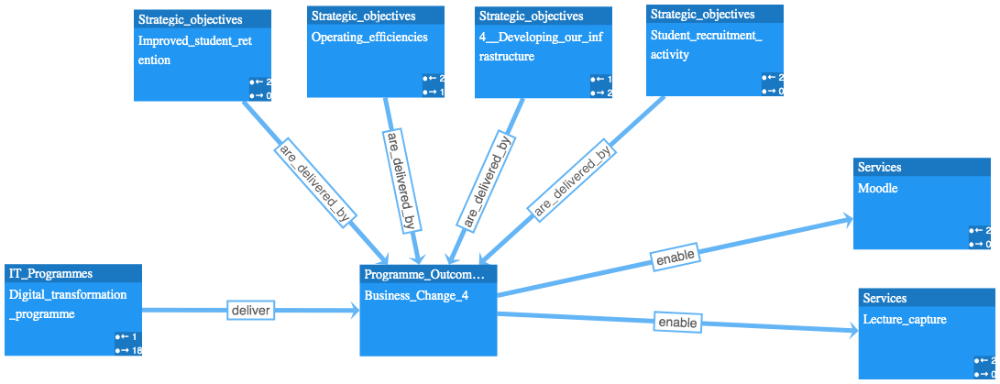
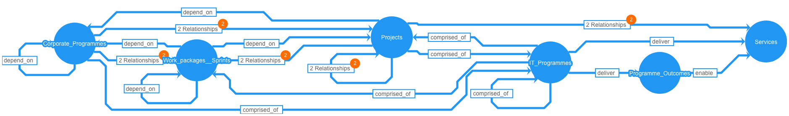
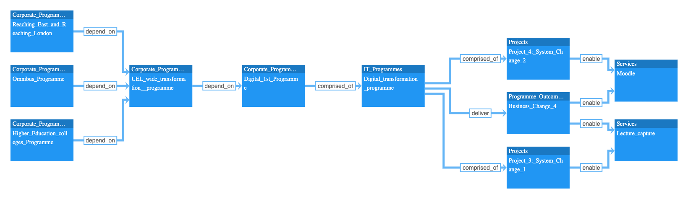
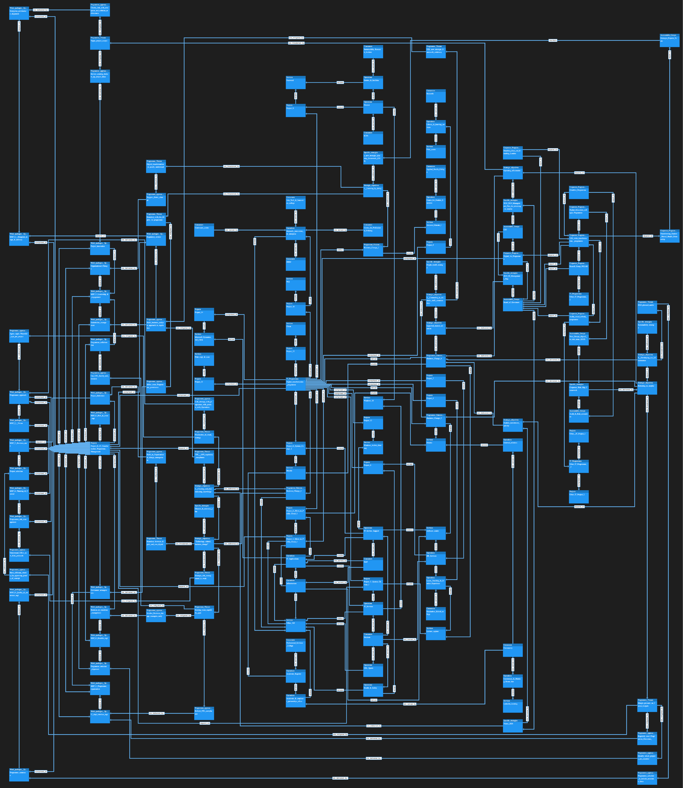

# One transformation programme, three working views

**A retained 2019–2020 modelling example. Reading guide repaired 1 October 2026.**

A university is changing its digital services. Strategy colleagues care about objectives and outcomes; operations colleagues care about services and the people using them; project teams care about the changes they must deliver. How can these conversations stay connected without making everybody work from the same crowded picture?

## Purpose

This example applies a graph data model to that question. It draws on public University of East London material, including its annual report, with guessed projects, services and other details. **It is a toy model and an interview-era working proposal, not a record of the university's actual programme or a current assessment of it.** The original principle remains: suggest, listen and change through discussion with the people who know the organisation.

[Back to the Library's modelling guide](https://lawrencerowland.github.io/Portfolio-data-model.html#read-the-worked-models) · [Library](https://lawrencerowland.github.io/library.html)

Historical background: [Data models for project portfolios — 7 May 2020](https://lawrencerowland.github.io/library/articles/data-models-for-project-portfolios.html).

*Start with the kinds of thing, before looking at the named examples. These boxes are visual groups in the drawing; they are not an organisational chart or a demonstrated class hierarchy. The overview omits relationship labels: the file guide explains the differences between the saved schemas.*

## Choose a way in

- **Understand the model choices:** [compare the two schemas and two instance drawings](READmeForprogrammegraphs.md). The filenames are retained, but the old guide's general-versus-specific ranking is corrected against their actual contents.
- **Read a role's view:** [operations](#operations-services-and-consumers), [strategy](#strategy-objectives-and-outcomes), or [projects](#projects-and-the-services-they-enable) below. Each pairs a relationship diagram with a named consultation example.
- **Inspect the working material:** [original notes and tables](#original-working-notes), [sponsorship questions](Programme%20Sponsorship%20questions.md), [three spreadsheet input iterations](spreadsheet-inputs-sequence/), or the [December 2019 print version (PDF)](print-versions/2019%2012%20Programme%20data%20model%20example%20for%20Education%20sector%20LR.pdf).

## From schema to particular names

A *schema* proposes kinds of things and relationships; an *instance graph* fills those roles with particular names. The preserved [Cypher input](cypher%20code%20for%20graph%20database/2019%2011%20Digital%20Transformation%20Programme%20Education%20cypher%20input%20LR%20Neo4j.txt) declares 150 nodes and 236 relationships, using 13 node labels and 15 literal relationship types. Two relationship spellings differ only by a trailing underscore; the [file guide](READmeForprogrammegraphs.md#what-the-counts-mean) explains that inconsistency. Nodes have supplied `id` and `name` properties; relationships are typed, without corresponding `id` or `name` properties in that input.

The three views below are saved illustrations. They help frame conversations about the same example; they do not update one another on this page. A drawn `enable` or `deliver` link records a modelling assumption, rather than proving a benefit or assigning a real organisation's decision rights.

## Operations: services and consumers

**Conversation:** which consumers use which services, who operates them, and which project outputs must an operations team accept?

*The relationship diagram keeps the kinds of thing visible.*

*The consultation example supplies names. Its HR and Health & Safety nodes both point through `accept` to Project_6. Those entries are prompts to discuss and correct, not evidence that these teams accepted an actual project.*

## Strategy: objectives and outcomes

**Conversation:** which outcome is supposed to serve an objective, which programme delivers it, and which services does it enable?

*Follow `Business_Change_4`: four strategic objectives point to it through `are_delivered_by`; the digital transformation programme points to it through `deliver`; it points to Moodle and Lecture_capture through `enable`. The placeholder outcome needs a meaningful description before this could guide a decision.*

## Projects and the services they enable

**Conversation:** how do the proposed projects sit within programmes, and how do their intended service changes relate to the outcome discussed by the strategy team?

[Inspect the wide project schema at full size](images/project-view.png).

*Here the same `Business_Change_4`, Moodle and Lecture_capture reappear. Project_4: System_Change_2 points to Moodle, while Project_3: System_Change_1 points to Lecture_capture. Shared names let the conversations meet; the picture supplies neither delivery dates nor a proof that the projects achieve the outcome.*

## Zoom out, or keep the neighbourhood small

*The full drawing retains breadth, at the cost of legibility. [Choose an editable source](READmeForprogrammegraphs.md#the-two-instance-drawings) to inspect individual labels.*

*The retained pared-back neighbourhood picture narrows attention; it is not established as a computed one-step ego view. Connected neighbours are not automatically members of the same group; a smaller view also leaves relationships out.*

## Read, edit or run

The pictures and explanations can be read here. The [GraphML files](graph_models/) retain editable drawings; the [file guide](READmeForprogrammegraphs.md) distinguishes their structures and formatting. The Cypher text is the historical database input. It creates records rather than maintaining a live programme or calculating a schedule; its compatibility with current Neo4j versions has not been checked. Opening a GraphML drawing and loading a database are separate steps. No database was run for this reading-guide repair.

## Original working notes

The following proposals, challenges and tables are retained from the original example. They mix public-source names, guesses and interview preparation. Read dated references and evaluative phrases in that historical context, not as verified or current statements about the university. The table itself records the author's caution that much of the proposed approach could be wrong and needs stakeholder discussion.

Read the original working notes and tables

ACCOUNTABLE GROUPS

Board of Governors

Audit & Risk committee

Strategic Projects Team

CIO

New Groups aligned to risk areas (2019)

STRATEGIES

Vision 2028

2015 20 Management Plan

a new strategic planning framework (2019)

2018 2019 Management Plan for returning to surplus

Corporate Risk Mgt framework

People (staff) strategy

OBJECTIVES

1 Learning by doing

2 Creating and disseminating knowledge

3 Connecting to students, staff, communities

4 Developing our infrastructure

“Technology related business change”

Returning to surplus

Student recruitment activity

Improved student retention

Operating efficiencies

Likely challenges

REGULATORY CHANGE

TEF OFS regulatory compliance

UEL new strategic framework underway

2020 planned audits

BROADER UEL CONTEXT

Strategic risk management is weak

Margin pressure on future budgets

Boundary with the Digital 1st programme

Boundary between digital and non digital

COMMON DIGITAL PROGRAMME CHALLENGES

Digital transformation is poorly understood

Vague project scopes

Finalisation of cloud strategy

Existing team capability gaps

Single most important aspect of approach

This is a toy model

Upfront and ongoing discussion with you and stakeholders

Only then does it become a real approach

SUGGEST, LISTEN, CHANGE

Regularly reset Programme Outcomes

Build in Organisational change management

Agree Agile / Waterfall type per project

Use UEL faculty and research

Involve Business change managers early

Link strategy with programme with product with Operations

SYSTEMATIC APPROACH TO RISK & REGS

Build business analysis approach to regulation

Programme schedule to include assurance dates

Understand UEL’s new Risk protocols

Define cross Programme governance

Refresh ITIL compliance

APPROPRIATE PROJECT APPRAISAL

Identify which projects are essential

Have different criteria for approving proofs of concept

Review existing bottom up project ideas

Clearly link with enterprise and solution architectures

Most of the approach elements managed within a suitable work-package of the Programme

| Operations                           | Services           | Consumers                      |
| ------------------------------------ | ------------------ | ------------------------------ |
| Infrastructure                       | Amazon Educate I   | Staff                          |
| IT Applications                      | Office 365         | Students                       |
| IT Services                          | Ebooks             | Community                      |
| IT Service Support                   | Lecture capture    | Applied Health College         |
| Academic & employer Partner office   | Moodle             | Professional Services College  |
| Academic Registry                    | Password           | Graduation School college      |
| Centre for Student Succcess          | Print centre       | Arts Tech & Innovation college |
| Conference & Meeting Room hire       | LinkedIn learning  | Research                       |
| Estates & facilities                 | Software centre    | KTPs                           |
| External relations                   | Windows 10         | Sustainability Institute       |
| Finance                              | Wifi               | IHHD                           |
| Health & Safety                      | Print copy & scan  | Centre for Prof. Policing      |
| HR Services                          | ITrent             | Continuum centre               |
| Learn, Teaching & Student Experience | Windows Active Dir |                                |
| Library & learning services          | MS Dynamics 365    |                                |

| Programme approach                                      | Description                                                                                                                                                                                                                                                                                                                    |
| ------------------------------------------------------- | ------------------------------------------------------------------------------------------------------------------------------------------------------------------------------------------------------------------------------------------------------------------------------------------------------------------------------ |
| Suggest, listen, change                                 | Of course I have no idea how UEL's  specific Digital Transformation should be run  I am answering the interview ‘exam question’ but most of this will be wrong  What will be crucial will be to  suggest ideas, but then to listen over time to stakeholders that know the Organisation  and change the approach accordingly   |
| Build business analysis approach to regulation          | Build a robust , specific business analysis approach to regulatory capture                                                                                                                                                                                                                                                     |
| Programme schedule to include assurance dates           | Programme schedule anticipates assurance and audit dates as well as delivery milestones (IPA consequential assurance framework)                                                                                                                                                                                                |
| Understand UEL’s new Risk protocols                     | Work early with Strategic Projects Team to understand emerging Risk protocols                                                                                                                                                                                                                                                  |
| Identify which projects are essential                   | From the start, be clear which projects are essential, and which can be delivered in other ways                                                                                                                                                                                                                                |
| Regularly reset Programme Outcomes                      | Plan for regular reassessments of Programme Outcomes and Benefits with main stakeholders                                                                                                                                                                                                                                       |
| Have different criteria for approving proofs of concept | Have a small separate budget for high risk, high reward proofs of concept and experiments that are not yet core to UEL business and have lower risk hurdle rates for accepting lower experiment budgets (see Deloitte 2012)                                                                                                    |
| define cross Programme governance                       | Use Portfolio Management best practice to define cross Programme governance early                                                                                                                                                                                                                                              |
| Build in Organisational change management               | Flexibility is inevitable so build in Organisational change management work package from the start, so that behaviours and culture can lead governance, rather than the other way round  This can include the use of the excellent Open Group Digital Practitioner framework for Digital Transformations                       |
| Review existing bottom up project ideas                 | Review existing bottom up project ideas and proposals to meet top down Digital Transformation objectives i e  there are likely to be good ideas already in development from the IT and other Departments,                                                                                                                      |
| Clearly link with enterprise and solution architectures | Clearly link enterprise and solution architectures to programme archite, e.g. by applying the IT4IT data model                                                                                                                                                                                                                 |

| Programme Challenges                        | Programme approach                                        |
| ------------------------------------------- | --------------------------------------------------------- |
| Digital transformation is poorly understood | Suggest, listen, change                                   |
| TEF   OFS regulatory compliance             | Build business analysis approach to regulation            |
| UEL new strategic framework underway        |                                                           |
| 2020 planned audits                         | Programme schedule to include assurance dates             |
| Strategic risk management is weak           | Understand UEL’s new Risk protocols                       |
| Margin pressure on future budgets           | Identify which projects are essential                     |
|                                             | Regularly reset Programme Outcomes                        |
|                                             | Have different criteria for approving proofs of concept   |
| Boundary with the Digital 1st programme     | define cross Programme governance                         |
| Boundary between digital and non digital    | Build in Organisational change management                 |
| Vague project scopes                        | Review existing bottom up project ideas                   |
|                                             | Clearly link with enterprise and solution architectures   |
| Finalisation of cloud strategy              | Link strategy with programme with product with Operations |
|                                             | Agree Agile Waterfall type per project                    |
| Existing team capability gaps               | Use UEL faculty and research                              |
|                                             | Involve Business change managers early                    |
|                                             | Refresh ITIL compliance                                   |

| Relevant Work-package             |                                                           |
| --------------------------------- | --------------------------------------------------------- |
|                                   | Programme Challenges                                      |
| IT dept interface mgt             | Regularly reset Programme Outcomes                        |
| Project selection                 | Have different criteria for approving proofs of concept   |
| Govenance arrangements            | define cross Programme governance                         |
| Project Definition                | Build in Organisational change management                 |
| Project innovation                | Review existing bottom up project ideas                   |
| Enterprise architecture alignment | Clearly link with enterprise and solution architectures   |
| Programme approach                | Link strategy with programme with product with Operations |
|                                   | Agree Agile Waterfall type per project                    |
| Programme collaboration           | Use UEL faculty and research                              |
| Business & transition management  | Involve Business change managers early                    |
| IT dept interface mgt             | Refresh ITIL compliance                                   |

[Compare the model files](READmeForprogrammegraphs.md) · [Return to the Library](https://lawrencerowland.github.io/library.html)
